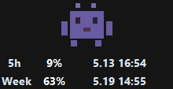
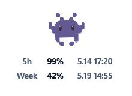

# Codex Pet Quota

Show Codex remaining quota under your Codex Desktop pet.

<p>
  
  
</p>

## Install

```sh
npm install -g codex-pet-quota
codex-pet-quota install
```

Then click or hover your Codex pet.

## Support

| System | Status |
| --- | --- |
| Windows | Supported |
| macOS | Apple Silicon only (M-series). Uses a tiny local Swift/AppKit helper; if macOS asks for Command Line Tools, run `xcode-select --install`. |
| Linux | Not supported yet. The command will print: waiting for Codex for Linux, then we will adapt it. |

## Commands

```sh
codex-pet-quota status
codex-pet-quota stop
codex-pet-quota uninstall
codex-pet-quota -h
codex-pet-quota --version
```

To remove everything:

```sh
codex-pet-quota uninstall
npm uninstall -g codex-pet-quota
```

You can also run `npm uninstall -g codex-pet-quota` directly. The background app will notice that the package was removed and clean up its startup files within a few seconds.

Do not include a version in the uninstall command.

## Notes

- Runs in the background and starts on login.
- Shows 5-hour and weekly quota plus reset times.
- Refreshes quota in memory every minute.
- Warns at `20%`, `10%`, and `5%`.
- Reads your local Codex login from `~/.codex/auth.json`.
