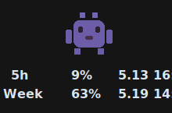
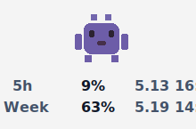

# Codex Pet Quota

Show your Codex remaining quota directly under your Codex Desktop pet.

Hover or click the pet to see:

- 5-hour remaining quota
- weekly remaining quota
- reset time for both windows
- proactive warnings at `20%`, `10%`, and `5%`

The tool runs outside Codex Desktop. It does not patch Codex files, so normal Codex updates should not overwrite it.

<p>
  
  
</p>

## Install

If the package is published on npm:

```powershell
npx codex-pet-quota@latest install
```

You can also run it directly from GitHub:

```powershell
npx github:kname1/codex-pet-quota install
```

Then open Codex Desktop, select any pet, and hover or click the pet.

After install, the app starts in the background when you log in, so it is ready whenever your pet appears.

## Usage

```powershell
npx codex-pet-quota@latest start
npx codex-pet-quota@latest status
npx codex-pet-quota@latest stop
npx codex-pet-quota@latest uninstall
```

Global install:

```powershell
npm install -g codex-pet-quota
codex-pet-quota install
```

If Electron downloads slowly on Windows:

```powershell
$env:ELECTRON_MIRROR='https://npmmirror.com/mirrors/electron/'
npx codex-pet-quota@latest install
```

## Behavior

- Hover or click the pet to show quota.
- The quota label auto-hides after a few seconds.
- Dragging the pet hides the quota label.
- Quota refreshes in the background every minute, so display is usually instant.
- When 5-hour or weekly quota reaches `20%`, `10%`, or `5%`, the label proactively appears with a short pop animation.
- `Ctrl+Alt+Q` is available as a fallback shortcut.

## Privacy

All quota fetching happens locally on your machine.

The app reads your local Codex auth file only to request your quota from ChatGPT/Codex. Tokens are never sent to any third-party server by this tool.

## How It Works

- Reads pet position from `~/.codex/.codex-global-state.json`.
- Passively detects pet hover/click on Windows without blocking pet drag.
- Shows a transparent Electron overlay under the pet.
- Fetches usage from `https://chatgpt.com/backend-api/wham/usage` using the local Codex OAuth token in `~/.codex/auth.json`.
- Falls back to `~/.codex/usage-limits.json` if available.
- Reset times come from the usage API's `reset_at` timestamp. Codex Desktop may show the weekly reset as a date only, but the API includes the exact time.

## Platform Status

- Windows: primary target and currently supported.
- macOS/Linux: planned. The project is structured to allow platform adapters, but the first release focuses on Windows.

## Development

```powershell
npm install
npm run dev
npm run lint
```
